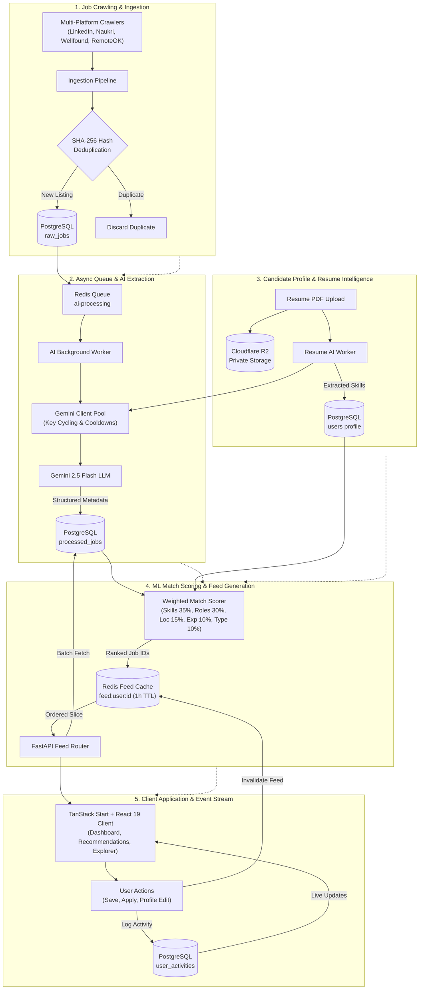

# OpportuneAI

<p align="center">
  <strong>AI-Powered Autonomous Job Discovery & Application Copilot</strong>
</p>

<p align="center">
  
  
  
  
  
  
</p>

---

OpportuneAI is an end-to-end AI-powered job discovery and application tracking platform. It crawls opportunities across major hiring platforms (LinkedIn, Naukri, Wellfound, RemoteOK), extracts structured metadata with Google Gemini LLMs, scores match suitability against user career profiles, and serves an intelligent, personalized feed through a React 19 / TanStack Start frontend.

---

## 🏛️ System Architecture



---

## 🧠 Job Ranking & Feed Generation Logic

The personalized feed generation pipeline (`backend/services/scoring.py` and `backend/services/feed_service.py`) calculates match compatibility between candidate profiles and processed jobs using a weighted multi-factor scoring algorithm.

### 1. Weighted Scoring Model
Each job is evaluated against the candidate's preferences across 5 weighted dimensions:

| Dimension | Weight | Evaluation Method |
| :--- | :---: | :--- |
| **Technical Skills** | **35%** | Variable-length normalized intersection between candidate proficiencies and required job skills. |
| **Target Roles** | **30%** | Substring / keyword fuzzy matching between user preferred titles and job title. |
| **Location & Work Mode** | **15%** | Preferred cities matching + work style alignment (`remote`, `hybrid`, `onsite`). |
| **Experience & Seniority** | **10%** | Experience level comparison (`entry`, `mid`, `senior`, `lead`) with numeric year tolerances. |
| **Employment Type** | **10%** | Match on contract/full-time/internship preferences. |

### 2. Variable-Length Skill Overlap Normalization
To prevent large skill lists from dominating and fairly reward dense relevance, the skill similarity score uses geometric mean normalization with a scaling factor:

$$\text{Skill Score} = \min\left(1.0, \frac{|S_{\text{candidate}} \cap S_{\text{job}}|}{\sqrt{|S_{\text{candidate}}| \times |S_{\text{job}}|}} \times 1.25\right)$$

- Exact and case-insensitive canonical tokens are reconciled against standard technical vocabularies.
- Soft buzzwords and generic office tools are excluded from the denominator.

### 3. Cold-Start Fallback Ranking
For users without explicit skill lists or newly registered profiles:
- System transitions to a recency-weighted completeness fallback.
- Computes rank scores based on posting freshness, salary transparency, and description completeness.

### 4. Feed Caching & Two-Tier Invalidation (Redis + PostgreSQL)
1. **Redis Ranking Cache**: High-scoring candidate feeds are computed once and stored in Redis under `feed:user:{user_id}` (1-hour TTL) as ordered lists of job IDs.
2. **Order-Preserving Batch Queries**: Pagination reads job IDs from Redis (`ZRANGE` / sliced list), and retrieves full job payloads from PostgreSQL with a single `WHERE id IN (...)` query, re-sorted in-memory to preserve rank sequence.
3. **Event-Driven Cache Invalidation**: The feed cache is automatically cleared and recalculated when:
   - Candidate updates profile skills or target preferences (`PUT /api/users/me`).
   - Resume AI extraction completes (`resume_worker.py`).
   - Candidate performs interaction events (`save`, `unsave`, `apply`, `dismiss`, `not_interested` via `POST /api/v1/events/jobs`).

---

## ⚡ Key Features

- **Multi-Source Scraping**: Integrated scrapers for LinkedIn, Naukri, Wellfound (Firecrawl markdown), and RemoteOK.
- **SHA-256 Job Fingerprinting**: Prevents duplicate listings across multiple crawling runs using `title|company|date_posted|location` hashing.
- **Gemini Client Pool**: Thread-safe multi-API-key cycling with rate-limit tracking and automatic cooldown flags.
- **Resume Intelligence**: Private Cloudflare R2 PDF document storage, in-memory text parsing (`pypdf`), and async LLM skill extraction.
- **Real Activity & Notification Feed**: Centralized `user_activities` ledger tracking job bookmarks, applications, resume processing milestones, and profile updates.
- **Role-Based Access Control (RBAC)**: Fine-grained admin dashboard and metrics gated by JWT claims and email allowlists.
- **Modern UI / UX**: Built on TanStack Start, React 19, Tailwind CSS v4, custom OKLCH dark/light themes, and skeleton shimmer loaders.

---

## 📁 Repository Structure

```
OpportuneAI/
├── backend/
│   ├── ai/                      # Gemini LLM extractors, prompt templates & client pools
│   │   ├── extraction/          # Job & resume parsing prompts
│   │   ├── pools/               # Thread-safe multi-key Gemini pooling
│   │   └── schemas.py           # Pydantic extraction output schemas
│   ├── config/                  # Configuration loaders, settings & YAML definitions
│   ├── database/                # SQLAlchemy models, async session & repositories
│   │   ├── models/              # User, RawJob, ProcessedJob, UserActivity, UserJobEvent
│   │   ├── repositories/        # Database CRUD encapsulation classes
│   │   └── seed.py              # Realistic sample data seed generator
│   ├── ingestion/               # Scraping orchestrator & deduplication pipeline
│   ├── migrations/              # Alembic database migration revisions
│   ├── providers/               # Platform adapter interfaces (LinkedIn, Naukri, Wellfound, RemoteOK)
│   ├── routes/                  # FastAPI routers (auth, feed, jobs, events, notifications, resume, admin)
│   ├── services/                # Feed service & deterministic scoring engine
│   ├── storage/                 # Cloudflare R2 S3-compatible client wrappers
│   ├── workers/                 # Background RQ worker consumers (ai_worker, resume_worker)
│   └── tests/                   # Complete pytest suite (unit, integration, API)
├── frontend/
│   ├── src/
│   │   ├── components/          # UI primitives (JobCard, StatCard, SearchCombobox, Layouts)
│   │   ├── hooks/               # Auth, theme, and query management hooks
│   │   ├── lib/                 # Typed API client adapters & formatting utilities
│   │   ├── routes/              # TanStack Start file-based routing views
│   │   └── styles.css           # OKLCH design tokens & animations
├── docs/                        # Architecture memory and current system states
├── DOCUMENTATION.md             # In-depth technical architecture details
├── CLAUDE.md                    # Developer guidelines and commands
└── GEMINI.md                    # Gemini LLM pooling and prompt details
```

---

## 🛠️ Tech Stack

### Backend
- **Language & Framework**: Python 3.11+, FastAPI, Uvicorn
- **ORM & Migrations**: SQLAlchemy 2.0 (asyncio + asyncpg), Alembic
- **Background Tasks**: Redis, Python RQ (Redis Queue)
- **AI & LLM**: Google Gemini (`gemini-2.5-flash`), LangChain, OpenRouter
- **Storage**: PostgreSQL, Redis, Cloudflare R2 (`boto3`)
- **Scraping**: Firecrawl API, `undetected-chromedriver`, Selenium, BeautifulSoup4

### Frontend
- **Framework**: React 19, TanStack Start (Router + Nitro SSR)
- **State & Data**: TanStack Query (React Query)
- **Styling**: Tailwind CSS v4, Lucide Icons, OKLCH Color Tokens
- **Auth**: Auth0 React SPA SDK with PKCE & JWKS token verification

---

## 🚀 Getting Started

### 1. Prerequisites
- **Python 3.11+**
- **Node.js 20+** & **npm**
- **PostgreSQL 15+**
- **Redis 7+**
- **Google Chrome** (for undetected-chromedriver crawler)

---

### 2. Backend Setup

1. **Navigate to the backend directory and create a virtual environment**:
   ```bash
   cd backend
   python3 -m venv venv
   source venv/bin/activate
   ```

2. **Install dependencies**:
   ```bash
   pip install -r requirements.txt
   ```

3. **Configure environment variables**:
   ```bash
   cp .env.example .env
   ```
   *Fill in your PostgreSQL URL, Redis host, Google AI Studio keys (`GEMINI_API_KEYS`), and Auth0 credentials.*

4. **Run database migrations**:
   ```bash
   alembic upgrade head
   ```

5. **(Optional) Seed demo jobs**:
   ```bash
   python database/seed.py
   ```

6. **Start the FastAPI backend server**:
   ```bash
   uvicorn app:app --reload --port 8000
   ```

7. **Start background workers (in separate terminal tabs)**:
   ```bash
   # AI Job Processing Worker
   rq worker ai-processing

   # Resume Analysis Worker
   rq worker resume-processing
   ```

---

### 3. Frontend Setup

1. **Navigate to the frontend directory**:
   ```bash
   cd frontend
   ```

2. **Install dependencies**:
   ```bash
   npm install
   ```

3. **Configure environment variables**:
   ```bash
   cp .env.example .env
   ```

4. **Start the development server**:
   ```bash
   npm run dev
   ```
   The application will be accessible at `http://localhost:3000`.

---

## 🧪 Testing & Code Quality

### Backend Tests & Linting
```bash
cd backend

# Run complete pytest test suite
pytest

# Run tests with clean output
pytest -p no:warnings

# Run Ruff linter and formatter
ruff check .
ruff format . --check
```

### Frontend Typecheck & Build
```bash
cd frontend

# Build SSR and client bundles
npm run build
```

---

## 📄 License & Documentation

- [GEMINI.md](GEMINI.md) — Multi-API-Key Pooling & Structured Output Details
- [CLAUDE.md](CLAUDE.md) — Coding Standards & Development Guidelines
- [docs/context.md](docs/context.md) — Architectural Memory & System Invariants