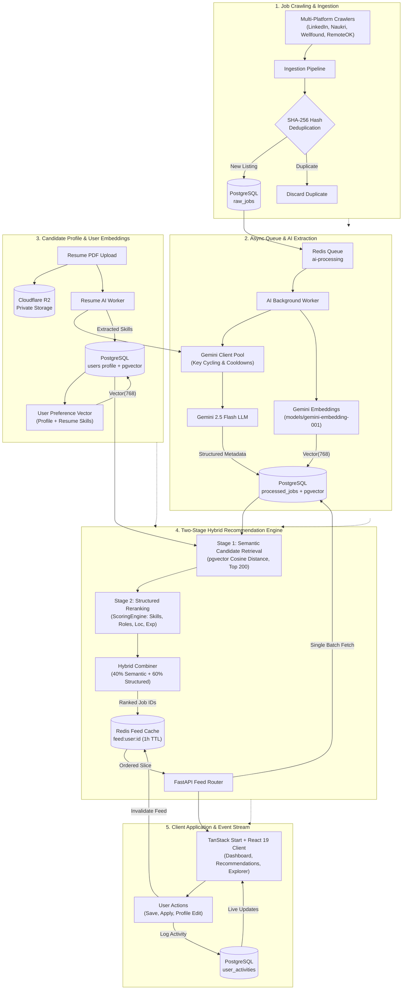

# OpportuneAI

<p align="center">
  <strong>AI-Powered Autonomous Job Discovery & Application Copilot</strong>
</p>

<p align="center">
  
  
  
  
  
  
</p>

---

OpportuneAI is an end-to-end AI-powered job discovery and application tracking platform. It crawls opportunities across major hiring platforms (LinkedIn, Naukri, Wellfound, RemoteOK), extracts structured metadata with Google Gemini LLMs, scores match suitability against user career profiles, and serves an intelligent, personalized feed through a React 19 / TanStack Start frontend.

---

## 🏛️ System Architecture



---

## 🧠 Two-Stage Hybrid Job Recommendation Engine

The personalized recommendation system (`backend/ai/embeddings/`, `backend/services/scoring.py`, and `backend/services/feed_service.py`) combines dense vector semantic candidate retrieval with deterministic structured reranking.

```
Candidate Profile / Resume
           ↓
Canonical User Preference Text
           ↓
Google Gemini Embeddings (768-dim)
           ↓
[Stage 1] pgvector Cosine Distance Retrieval (Top 200 unexpired jobs)
           ↓
[Stage 2] Deterministic ScoringEngine Reranking (Skills, Roles, Loc, Mode, Exp)
           ↓
Hybrid Final Score = 0.40 × (Semantic × 100) + 0.60 × Structured Score
           ↓
Ranked Job IDs cached in Redis (feed:user:{id}, 1h TTL)
           ↓
1 Batch PostgreSQL Query (WHERE id IN (...)) for paginated page delivery
```

### 1. Stage 1 — Semantic Candidate Retrieval (pgvector)
- **Precomputed Job Embeddings**: During job ingestion (`ai_worker.py`), a canonical representation (Title, Company, Skills, Location, Work Mode, Employment Type, Experience, Description) is embedded once via Google Gemini (`models/gemini-embedding-001`, dim 768) and persisted in PostgreSQL `processed_jobs.embedding`.
- **Dynamic User Preference Vectors**: Generated from profile skills, resume-extracted skills, preferred roles, target locations, and seniority.
- **Database-Side Vector Search**: Computes cosine distance directly in PostgreSQL using pgvector `<=>` operator over unexpired listings:
  ```sql
  SELECT * FROM processed_jobs 
  WHERE embedding IS NOT NULL AND (last_date_to_apply IS NULL OR last_date_to_apply >= NOW())
  ORDER BY embedding <=> :user_embedding 
  LIMIT 200;
  ```

### 2. Stage 2 — Structured Reranking (`ScoringEngine`)
Candidates from Stage 1 are reranked against explicit user constraints across 5 dimensions:

| Dimension | Weight | Evaluation Method |
| :--- | :---: | :--- |
| **Technical Skills** | **35%** | Variable-length normalized intersection between candidate proficiencies and required job skills. |
| **Target Roles** | **30%** | Substring / token fuzzy matching between preferred roles and job title. |
| **Location & Work Mode** | **15%** | Preferred cities matching + work style alignment (`remote`, `hybrid`, `onsite`). |
| **Experience & Seniority** | **10%** | Experience level comparison (`entry`, `mid`, `senior`, `lead`) with numeric year tolerances. |
| **Employment Type** | **10%** | Match on contract/full-time/internship preferences. |

### 3. Hybrid Score Combination
Semantic relevance and explicit preference alignment are combined using centralized, configurable weights:

$$\text{Final Score} = 0.40 \times (\text{Cosine Similarity} \times 100) + 0.60 \times \text{Structured Score}$$

### 4. Cold-Start Fallback Ranking
For users without sufficient profile or resume data:
- System bypasses semantic candidate retrieval and falls back to deterministic quality scoring based on recency, salary transparency, and completeness.

### 5. Feed Caching & Invalidation (Redis + PostgreSQL)
1. **Redis Ranking Cache**: Ranked job ID arrays are cached under `feed:user:{user_id}` (1-hour TTL).
2. **Order-Preserving Batch Queries**: Pagination slices job IDs from Redis and retrieves full job records in **1 single batch query** (`WHERE id IN (...)`), re-sorted in-memory to preserve rank order. Zero N+1 queries.
3. **Event-Driven Invalidation**: Feed cache is cleared and preference vector refreshed on:
   - Profile preference edits (`PUT /api/users/me`).
   - Resume AI parse completion (`resume_worker.py`).
   - Resume deletion (`DELETE /api/resume`).
   - Significant interaction events (`save`, `unsave`, `apply`, `dismiss`, `not_interested`).

---

## ⚡ Key Features

- **Multi-Source Scraping**: Integrated scrapers for LinkedIn, Naukri, Wellfound (Firecrawl markdown), and RemoteOK.
- **SHA-256 Job Fingerprinting**: Prevents duplicate listings across multiple crawling runs using `title|company|date_posted|location` hashing.
- **Gemini Client Pool**: Thread-safe multi-API-key cycling with rate-limit tracking and automatic cooldown flags.
- **Resume Intelligence**: Private Cloudflare R2 PDF document storage, in-memory text parsing (`pypdf`), and async LLM skill extraction.
- **Real Activity & Notification Feed**: Centralized `user_activities` ledger tracking job bookmarks, applications, resume processing milestones, and profile updates.
- **Role-Based Access Control (RBAC)**: Fine-grained admin dashboard and metrics gated by JWT claims and email allowlists.
- **Modern UI / UX**: Built on TanStack Start, React 19, Tailwind CSS v4, custom OKLCH dark/light themes, and skeleton shimmer loaders.

---

## 📁 Repository Structure

```
OpportuneAI/
├── backend/
│   ├── ai/                      # Gemini LLM extractors, prompt templates & client pools
│   │   ├── embeddings/          # Vector embedding service & canonical text builders
│   │   ├── extraction/          # Job & resume parsing prompts
│   │   ├── pools/               # Thread-safe multi-key Gemini pooling
│   │   └── schemas.py           # Pydantic extraction output schemas
│   ├── config/                  # Configuration loaders, settings & YAML definitions
│   ├── database/                # SQLAlchemy models, async session & repositories
│   │   ├── models/              # User, RawJob, ProcessedJob, UserActivity, UserJobEvent
│   │   ├── repositories/        # Database CRUD encapsulation classes
│   │   └── seed.py              # Realistic sample data seed generator
│   ├── ingestion/               # Scraping orchestrator & deduplication pipeline
│   ├── migrations/              # Alembic database migration revisions (incl. pgvector)
│   ├── providers/               # Platform adapter interfaces (LinkedIn, Naukri, Wellfound, RemoteOK)
│   ├── routes/                  # FastAPI routers (auth, feed, jobs, events, notifications, resume, admin)
│   ├── services/                # Feed service, ScoringEngine, UserEmbeddingService & backfill
│   ├── storage/                 # Cloudflare R2 S3-compatible client wrappers
│   ├── workers/                 # Background RQ worker consumers (ai_worker, resume_worker)
│   └── tests/                   # Complete pytest suite (unit, integration, API, embeddings)
├── frontend/
│   ├── src/
│   │   ├── components/          # UI primitives (JobCard, StatCard, SearchCombobox, Layouts)
│   │   ├── hooks/               # Auth, theme, and query management hooks
│   │   ├── lib/                 # Typed API client adapters & formatting utilities
│   │   ├── routes/              # TanStack Start file-based routing views
│   │   └── styles.css           # OKLCH design tokens & animations
├── docs/                        # Architecture memory and current system states
├── DOCUMENTATION.md             # In-depth technical architecture details
├── CLAUDE.md                    # Developer guidelines and commands
└── GEMINI.md                    # Gemini LLM pooling and prompt details
```

---

## 🛠️ Tech Stack

### Backend
- **Language & Framework**: Python 3.11+, FastAPI, Uvicorn
- **ORM & Database**: PostgreSQL 17, pgvector extension, SQLAlchemy 2.0 (asyncio + asyncpg), Alembic
- **Background Tasks**: Redis, Python RQ (Redis Queue)
- **AI & Embeddings**: Google Gemini (`gemini-2.5-flash`, `models/gemini-embedding-001`), LangChain, OpenRouter
- **Storage**: PostgreSQL + pgvector, Redis, Cloudflare R2 (`boto3`)
- **Scraping**: Firecrawl API, `undetected-chromedriver`, Selenium, BeautifulSoup4

### Frontend
- **Framework**: React 19, TanStack Start (Router + Nitro SSR)
- **State & Data**: TanStack Query (React Query)
- **Styling**: Tailwind CSS v4, Lucide Icons, OKLCH Color Tokens
- **Auth**: Auth0 React SPA SDK with PKCE & JWKS token verification

---

## 🚀 Getting Started

### 1. Prerequisites
- **Python 3.11+**
- **Node.js 20+** & **npm**
- **PostgreSQL 15+** with **pgvector**
- **Redis 7+**
- **Google Chrome** (for undetected-chromedriver crawler)

---

### 2. Backend Setup

1. **Navigate to the backend directory and create a virtual environment**:
   ```bash
   cd backend
   python3 -m venv venv
   source venv/bin/activate
   ```

2. **Install dependencies**:
   ```bash
   pip install -r requirements.txt
   ```

3. **Configure environment variables**:
   ```bash
   cp .env.example .env
   ```
   *Fill in your PostgreSQL URL, Redis host, Google AI Studio keys (`GEMINI_API_KEYS`), and Auth0 credentials.*

4. **Run database migrations**:
   ```bash
   alembic upgrade head
   ```

5. **(Optional) Backfill embeddings for existing jobs**:
   ```bash
   python -m services.backfill_embeddings
   ```

6. **(Optional) Seed demo jobs**:
   ```bash
   python database/seed.py
   ```

7. **Start the FastAPI backend server**:
   ```bash
   uvicorn app:app --reload --port 8000
   ```

8. **Start background workers (in separate terminal tabs)**:
   ```bash
   # AI Job Processing Worker
   rq worker ai-processing

   # Resume Analysis Worker
   rq worker resume-processing
   ```

---

### 3. Frontend Setup

1. **Navigate to the frontend directory**:
   ```bash
   cd frontend
   ```

2. **Install dependencies**:
   ```bash
   npm install
   ```

3. **Configure environment variables**:
   ```bash
   cp .env.example .env
   ```

4. **Start the development server**:
   ```bash
   npm run dev
   ```
   The application will be accessible at `http://localhost:3000`.

---

## 🧪 Testing & Code Quality

### Backend Tests & Linting
```bash
cd backend

# Run complete pytest test suite
pytest

# Run tests with clean output
pytest -p no:warnings

# Run Ruff linter and formatter
ruff check .
ruff format . --check
```

### Frontend Typecheck & Build
```bash
cd frontend

# Build SSR and client bundles
npm run build
```

---

## 📄 License & Documentation

- [GEMINI.md](GEMINI.md) — Multi-API-Key Pooling & Structured Output Details
- [CLAUDE.md](CLAUDE.md) — Coding Standards & Development Guidelines
- [docs/context.md](docs/context.md) — Architectural Memory & System Invariants